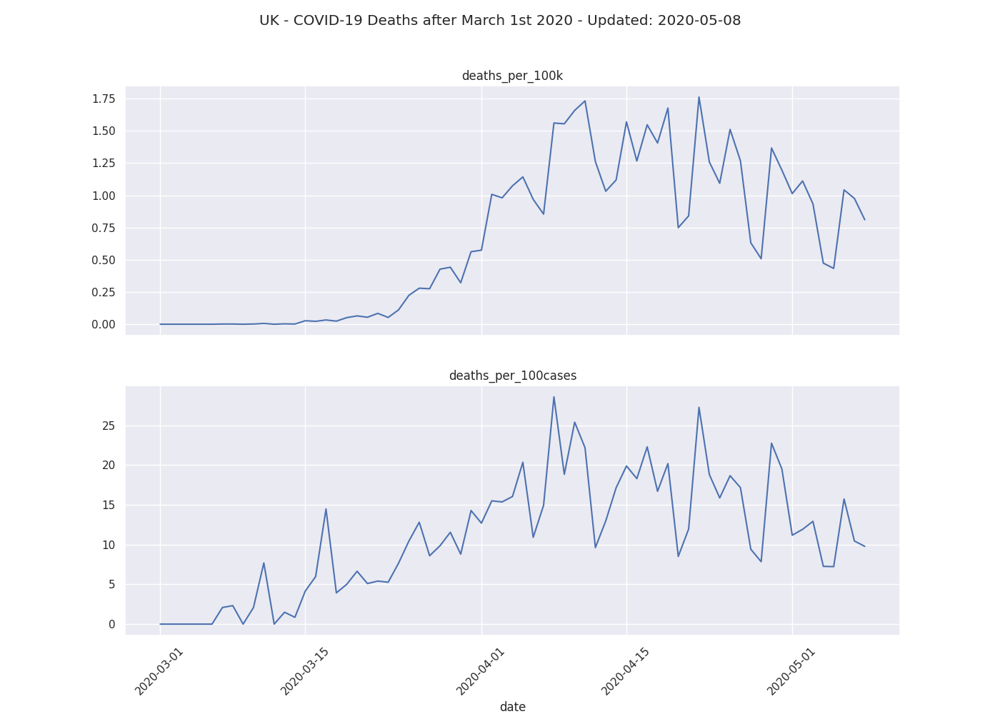
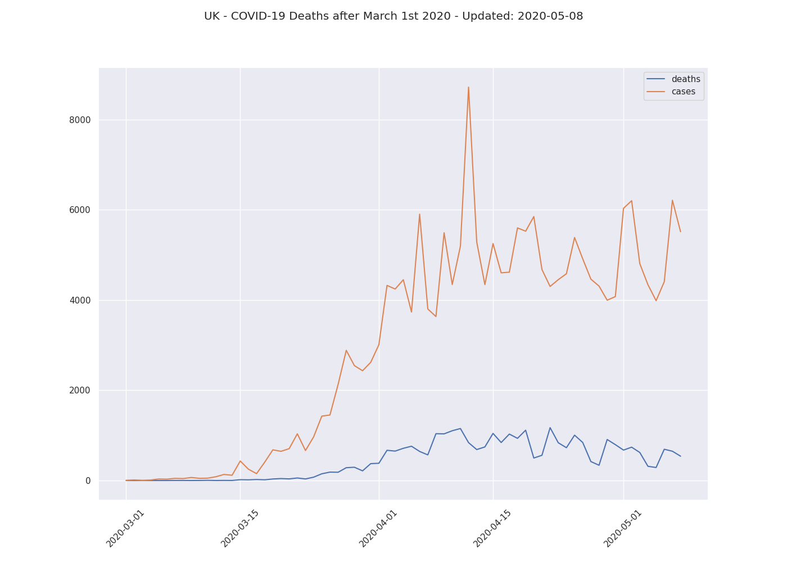

# python-datascience-projects 

## [generate-covid-visualization](generate-covid-visualization)

Fetch the latest data about COVID-19 deaths from the [EU Open Data Portal](https://data.europa.eu/euodp/en/data/dataset/covid-19-coronavirus-data/resource/55e8f966-d5c8-438e-85bc-c7a5a26f4863), process the data and save the visualization in two different formats (.png, .pdf). The filenames will reflect the date of when the data was last processed.

### Usage:

Use `./build.sh` to create the image `generate-covid-visualization` from the `Dockerfile`.

Use `./run.sh` to generate the `png` and `pdf` file that contain the visualization.

### Examples:

Examples of the png generated

- [2020-05-08-COVID-19-UK-data-visualization-01.png](generate-covid-visualization/2020-05-08-COVID-19-UK-data-visualization-01.png)

- [2020-05-08-COVID-19-UK-data-visualization-02.png](generate-covid-visualization/2020-05-08-COVID-19-UK-data-visualization-02.png)

